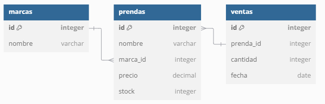

# Curso Plataformas Abiertas

## Descripción
Una API de una tienda de ropa implementada con bases de datos en SQL y en PHP.

## Diagrama de la estructura de datos
marcas: Contendrá las marcas disponibles.
prendas: Listará las prendas, con referencias a las marcas.
ventas: Registrará las ventas realizadas.



## Integrantes

Indira Picado Picado

## Uso de Endpoints de la API


1. Endpoints para obtener todas las marcas:
   - Método: GET
   - Endpoint: http://localhost/proyecto-tienda/scripts/public/index.php/marcas
   - Descripción: Obtiene una lista de todas las marcas disponibles en el sistema.

   ```http
   GET http://localhost/proyecto-tienda/scripts/public/index.php/marcas
   ```

   Ejemplo de respuesta:
   ```json
   [
      {
        "id": "1",
        "nombre": "Camisa Casual"
    },
    {
        "id": "2",
        "nombre": "Camisa Casual"
    },
    {
        "id": "3",
        "nombre": "Adiddas"
    },
    {
        "id": "4",
        "nombre": "blusa"
    },
    {
        "id": "5",
        "nombre": "medias"
    },
    {
        "id": "6",
        "nombre": "puma"
    },
    {
        "id": "7",
        "nombre": "pantalon"
    }
   ]
   ```

2. Endpoint para obtener un libro por ID:
   - Método: GET
   - Endpoint: `http://localhost/api/libreria-api/public/index.php/libros/{id-del-libro}`
   - Descripción: Obtiene la información de un libro específico usando su ID.

   ```http
   GET http://localhost/api/libreria-api/public/index.php/libros/{id-del-libro}
   ```

   Ejemplo de uso:
   ```http
   GET http://localhost/api/libreria-api/public/index.php/libros/1
   ```

   Ejemplo de respuesta:
   ```json
   {
     "id": 1,
     "titulo": "Libro A",
     "autor": "Autor X",
     "precio": 19.99
   }
   ```

3. Endpoint para insertar un libro:
   - Método: POST
   - Endpoint: `http://localhost/api/libreria-api/public/index.php/libros/`
   - Descripción: Inserta un nuevo libro en la base de datos.

   ```http
   POST http://localhost/api/libreria-api/public/index.php/libros/
   ```

   Cuerpo de la petición (JSON):
   ```json
   {
     "titulo": "Nuevo Libro",
     "autor": "Autor Z",
     "precio": 30.00
   }
   ```

   Ejemplo de respuesta:
   ```json
   {
     "mensaje": "Libro insertado exitosamente"
   }
   ```

4. Endpoint para actualizar un libro por ID:
   - Método: PUT
   - Endpoint: `http://localhost/api/libreria-api/public/index.php/libros/{id-del-libro}`
   - Descripción: Actualiza la información de un libro específico.

   ```http
   PUT http://localhost/api/libreria-api/public/index.php/libros/{id-del-libro}
   ```

   Cuerpo de la petición (JSON):
   ```json
   {
     "titulo": "Libro Actualizado",
     "autor": "Autor X",
     "precio": 35.00
   }
   ```

   Ejemplo de respuesta:
   ```json
   {
     "mensaje": "Libro actualizado exitosamente"
   }
   ```

5. Endpoint para eliminar un libro por ID:
   - Método: DELETE
   - Endpoint: `http://localhost/api/libreria-api/public/index.php/libros/{id-del-libro}`
   - Descripción: Elimina un libro específico de la base de datos.

   ```http
   DELETE http://localhost/api/libreria-api/public/index.php/libros/{id-del-libro}
   ```

   Ejemplo de respuesta:
   ```json
   {
     "mensaje": "Libro eliminado exitosamente"
   }
   ```